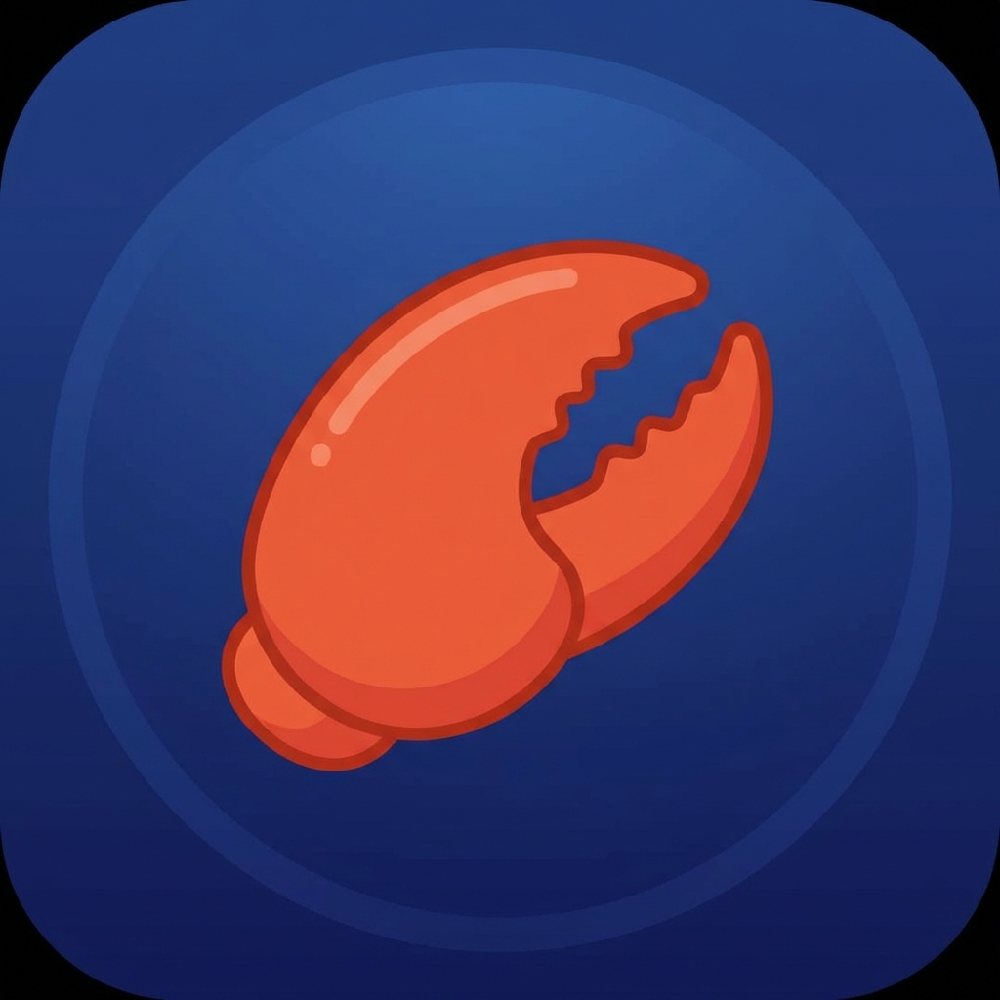

# 🦞 OpenClaw Desktop

<p align="center">
  
</p>

<p align="center">
  <strong>A native Windows desktop application for <a href="https://github.com/openclaw/openclaw">OpenClaw</a></strong><br>
  <em>The missing Windows GUI for your favorite AI assistant!</em>
</p>

<p align="center">
  
  
  
  
</p>

<p align="center">
  <a href="https://ko-fi.com/ai_dev_2024">
    
  </a>
</p>

---

## 🎯 Why OpenClaw Desktop?

**OpenClaw** is an amazing open-source AI assistant, but:

- ✅ **macOS** has a native menu bar app
- ✅ **Linux** works great with CLI
- ❌ **Windows** only has CLI or WSL2 — **no native desktop app!**

**OpenClaw Desktop fills this gap** — giving Windows users a beautiful, native GUI to manage their OpenClaw gateway.

---

## ✨ Features

| Feature | Description |
|---------|-------------|
| 🟢 **Gateway Status** | Real-time status indicator (🟢 Running / 🔴 Stopped) |
| ▶️ **Start/Stop/Restart** | One-click gateway control |
| 🌐 **Dashboard Access** | Opens OpenClaw web UI with auto-authentication |
| 📋 **Integrated Logs** | View gateway logs in-app — no separate CMD window! |
| 🔽 **System Tray** | Minimize to tray, quick access menu |
| 🚀 **Auto-Install** | Install OpenClaw automatically if not present |
| 🪶 **Lightweight** | Only ~20MB thanks to Tauri 2 |

---

## 📥 Installation

### Windows (Recommended)

Download the latest `.msi` or `.exe` from [Releases](../../releases).

### macOS

Download the `.dmg` from [Releases](../../releases).

### Linux

Download the `.AppImage` or `.deb` from [Releases](../../releases).

---

## 🖥️ Screenshots

*Coming soon!*

---

## 🛠️ Development

### Prerequisites

- [Node.js](https://nodejs.org/) 18+
- [Rust](https://rustup.rs/)
- [pnpm](https://pnpm.io/) or [bun](https://bun.sh/)

### Setup

```bash
# Clone the repo
git clone https://github.com/ai-dev-2024/openclaw-desktop.git
cd openclaw-desktop

# Install dependencies
pnpm install
# or: bun install

# Run in development mode
pnpm tauri dev
# or: bunx tauri dev

# Build for production
pnpm tauri build
```

---

## 🔄 Compatibility

| OpenClaw Version | Desktop App Version |
|------------------|---------------------|
| 2026.2.x | v0.0.2+ |
| 2026.1.x | v0.0.1+ |

The desktop app communicates with the OpenClaw gateway via HTTP on port `18789`. It should work with any OpenClaw version that supports the gateway feature.

---

## ☕ Support

If you find this project useful, please consider supporting development:

<a href="https://ko-fi.com/ai_dev_2024">
  
</a>

---

## 📄 License

MIT License - see [LICENSE](LICENSE) for details.

---

<p align="center">
  Made with ❤️ by <a href="https://ko-fi.com/ai_dev_2024">ai-dev-2024</a>
</p>
